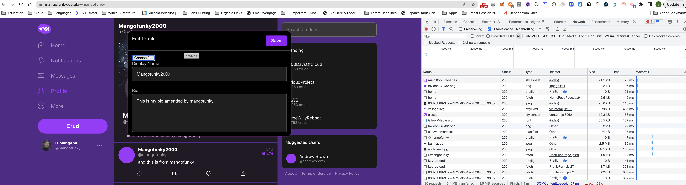
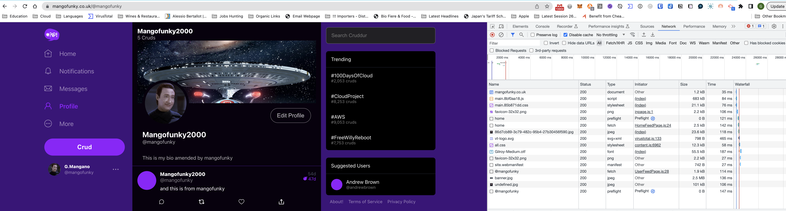

# Week 10 — CloudFormation Part 1

## Note to Andrew

I've been trying to work with Gitpod but for the last few weeks and for some unknown reasons I'm wasn't and still not able to connect to AWS despite hundreds of attempts. I also tried to issue new keys but no success. Had several tickets raised to the support team at Gitpod and through their discord channel chats but this produced no success. So everything here is based on memory, going through the videos again as much as I could and also looking at other peoples journals (not copying/cheatin or plagiarising  - everything here is my own work and words).
In particular I consulted the following bootcampers repos which I found useful to get an idea on how to write a journal entry:

https://github.com/beiciliang/aws-bootcamp-cruddur-2023/blob/main/journal/week10.md and 
https://github.com/Rietta1/aws-bootcamp-cruddur-2023/blob/main/journal/week10.md

Unfortunately due to the above I wasn't able to carry out further implementation of some of the functionality nor I could carry out debugging of the frontend. Please take this into account. 
I realised though in the last few days that the work around would have been to manually download the images from AWS and upload them Gitpod but this come to my mind too late to get on with it which is a shame! By this time I wasted so much time with trying to figure out the problem stopping me with everything else. I had a go with Jumppad as you recommended it, installed but the learningcurve to use it in the same way as Gitpod made me decide to learn it at a later stage as I wouldn't have had the time to submit.

When I try to login to ECR I always get:

```html
gitpod /workspace/aws-bootcamp-cruddur-2023 (main) $ ./bin/ecr/login 

An error occurred (404) when calling the GetAuthorizationToken operation: <!DOCTYPE html PUBLIC "-//W3C//DTD XHTML 1.0 Transitional//EN" "http://www.w3.org/TR/xhtml1/DTD/xhtml1-transitional.dtd">
<html xmlns="http://www.w3.org/1999/xhtml" xml:lang="en" lang="en">
<head>
  <title>Page Not Found</title>
</head>
<body>Page Not Found</body>
</html>
Error: Cannot perform an interactive login from a non TTY device
gitpod /workspace/aws-bootcamp-cruddur-2023 (main) $ 
```
or when calling

```python
gitpod /workspace/aws-bootcamp-cruddur-2023 (main) $ aws sts get-caller-identity

An error occurred (Unknown) when calling the GetCallerIdentity operation: Unknown
gitpod /workspace/aws-bootcamp-cruddur-2023 (main) $ 
```
and with no chance to get access to the logs

***

In this week we worked on CI/CD Pipeline using AWS Cloudformation

## Cruddur Stack


Full diagram available [here](https://drive.google.com/file/d/1RVzjeaFi76a1buCIZ8vapRjh_isMxNjf/view?usp=sharing)

## Index of work done

* [Cluster Stack](#cluster)

* [Networking Stack](#networking)

* [RDS Stack](#db)

* [Service Stack](#service)

* [Frontend Stack](#frontend)

* [CI/CD Stack](#cicd)

* [Sync Stack](#sync)

## Cluster - CFN Cluster Template<a name="cluster"></a> 

We created *cluster* directory *aws/cfn/cluster* for the *config.toml* and the *template.yaml* files

Run *./bin/cfn/cluster* command to generate the *CrdCluster* stack

```bash
#! /usr/bin/env bash
set -e # stop the execution of the script if it fails

CFN_PATH="/workspace/aws-bootcamp-cruddur-2023/aws/cfn/cluster/template.yaml"
CONFIG_PATH="/workspace/aws-bootcamp-cruddur-2023/aws/cfn/cluster/config.toml"
echo $CFN_PATH

cfn-lint $CFN_PATH

BUCKET=$(cfn-toml key deploy.bucket -t $CONFIG_PATH)
REGION=$(cfn-toml key deploy.region -t $CONFIG_PATH)
STACK_NAME=$(cfn-toml key deploy.stack_name -t $CONFIG_PATH)
PARAMETERS=$(cfn-toml params v2 -t $CONFIG_PATH)

aws cloudformation deploy \
  --stack-name $STACK_NAME \
  --s3-bucket $BUCKET \
  --region $REGION \
  --template-file "$CFN_PATH" \
  --no-execute-changeset \
  --tags group=cruddur-cluster \
  --parameter-overrides $PARAMETERS \
  --s3-prefix "cluster" \
  --capabilities CAPABILITY_NAMED_IAM
```

## Networking Stack - CFN Network Template<a name="networking"></a>

We created the networking directory *aws/cfn/networking* with the *config.toml* and the *template.yaml* files

Run *./bin/cfn/networking* command to generate the *CrdNet* stack

The template creates a /16 CIDR VPC with 6 subnets for each private and public, IGW and RT, RT associations and Outputs to be used by other CFN templates and can be seen [here](aws/cfn/networking/template.yaml)

I run the following command *./bin/cfn/networking* to create the *CrdNet* stack

```bash
#! /usr/bin/env bash
set -e # stop the execution of the script if it fails

CFN_PATH="/workspace/aws-bootcamp-cruddur-2023/aws/cfn/networking/template.yaml"
CONFIG_PATH="/workspace/aws-bootcamp-cruddur-2023/aws/cfn/networking/config.toml"
echo $CFN_PATH
echo $CONFIG_PATH
cfn-lint $CFN_PATH

BUCKET=$(cfn-toml key deploy.bucket -t $CONFIG_PATH)
REGION=$(cfn-toml key deploy.region -t $CONFIG_PATH)
STACK_NAME=$(cfn-toml key deploy.stack_name -t $CONFIG_PATH)

aws cloudformation deploy \
  --stack-name $STACK_NAME \
  --s3-bucket $BUCKET \
  --s3-prefix "networking" \
  --region $REGION \
  --template-file "$CFN_PATH" \
  --no-execute-changeset \
  --tags group=cruddur-networking \
  --capabilities CAPABILITY_NAMED_IAM
```


## RDS Stack - CFN RDS DB Template<a name="db"></a>

We created *cluster* directory *aws/cfn/db* for the *config.toml* and the *template.yaml* files
Run *./bin/cfn/db* command to generate the *CrdDb* stack

```bash
#! /usr/bin/env bash
set -e # stop the execution of the script if it fails

CFN_PATH="/workspace/aws-bootcamp-cruddur-2023/aws/cfn/db/template.yaml"
CONFIG_PATH="/workspace/aws-bootcamp-cruddur-2023/aws/cfn/db/config.toml"
echo $CFN_PATH

cfn-lint $CFN_PATH

BUCKET=$(cfn-toml key deploy.bucket -t $CONFIG_PATH)
REGION=$(cfn-toml key deploy.region -t $CONFIG_PATH)
STACK_NAME=$(cfn-toml key deploy.stack_name -t $CONFIG_PATH)
PARAMETERS=$(cfn-toml params v2 -t $CONFIG_PATH)

aws cloudformation deploy \
  --stack-name $STACK_NAME \
  --s3-bucket $BUCKET \
  --s3-prefix "db" \
  --region $REGION \
  --template-file "$CFN_PATH" \
  --no-execute-changeset \
  --tags group=cruddur-db \
  --parameter-overrides $PARAMETERS MasterUserPassword=$DB_PASSWORD \
  --capabilities CAPABILITY_NAMED_IAM
```

## Service Stack - CFN Backend Stack Template<a name="service"></a>

We created *cluster* directory *aws/cfn/service* for the *config.toml* and the *template.yaml* files

Run *./bin/cfn/service* command to generate the *CrdSrvBackendFlask* backend stack

```bash
#! /usr/bin/env bash
set -e # stop the execution of the script if it fails

CFN_PATH="/workspace/aws-bootcamp-cruddur-2023/aws/cfn/service/template.yaml"
CONFIG_PATH="/workspace/aws-bootcamp-cruddur-2023/aws/cfn/service/config.toml"
echo $CFN_PATH

cfn-lint $CFN_PATH

BUCKET=$(cfn-toml key deploy.bucket -t $CONFIG_PATH)
REGION=$(cfn-toml key deploy.region -t $CONFIG_PATH)
STACK_NAME=$(cfn-toml key deploy.stack_name -t $CONFIG_PATH)
PARAMETERS=$(cfn-toml params v2 -t $CONFIG_PATH)

aws cloudformation deploy \
  --stack-name $STACK_NAME \
  --s3-bucket $BUCKET \
  --s3-prefix "backend-service" \
  --region $REGION \
  --template-file "$CFN_PATH" \
  --no-execute-changeset \
  --tags group=cruddur-backend-flask \
  --parameter-overrides $PARAMETERS \
  --capabilities CAPABILITY_NAMED_IAM
```

## Frontend Stack - CFN Frontend Template<a name="frontend"></a>

We created *cluster* directory *aws/cfn/frontend* for the *config.toml* and the *template.yaml* files

Run *./bin/cfn/frontend* command to generate the *CrdFrontend* stack

```bash
#! /usr/bin/env bash
set -e # stop the execution of the script if it fails

CFN_PATH="/workspace/aws-bootcamp-cruddur-2023/aws/cfn/frontend/template.yaml"
CONFIG_PATH="/workspace/aws-bootcamp-cruddur-2023/aws/cfn/frontend/config.toml"
echo $CFN_PATH

cfn-lint $CFN_PATH

BUCKET=$(cfn-toml key deploy.bucket -t $CONFIG_PATH)
REGION=$(cfn-toml key deploy.region -t $CONFIG_PATH)
STACK_NAME=$(cfn-toml key deploy.stack_name -t $CONFIG_PATH)
PARAMETERS=$(cfn-toml params v2 -t $CONFIG_PATH)

aws cloudformation deploy \
  --stack-name $STACK_NAME \
  --s3-bucket $BUCKET \
  --s3-prefix frontend \
  --region $REGION \
  --template-file "$CFN_PATH" \
  --no-execute-changeset \
  --tags group=cruddur-frontend \
  --parameter-overrides $PARAMETERS \
  --capabilities CAPABILITY_NAMED_IAM
```

## CI/CD - CFN CI/CD Template<a name="cicd"></a>

We created CI/CD directory *aws/cfn/cicd* for the *config.toml* and the *template.yaml* files

Run *./bin/cfn/cicd* command to generate the *CrdCicd* stack

```bash
#! /usr/bin/env bash
#set -e # stop the execution of the script if it fails

CFN_PATH="/workspace/aws-bootcamp-cruddur-2023/aws/cfn/cicd/template.yaml"
CONFIG_PATH="/workspace/aws-bootcamp-cruddur-2023/aws/cfn/cicd/config.toml"
PACKAGED_PATH="/workspace/aws-bootcamp-cruddur-2023/tmp/packaged-template.yaml"
PARAMETERS=$(cfn-toml params v2 -t $CONFIG_PATH)
echo $CFN_PATH

cfn-lint $CFN_PATH

BUCKET=$(cfn-toml key deploy.bucket -t $CONFIG_PATH)
REGION=$(cfn-toml key deploy.region -t $CONFIG_PATH)
STACK_NAME=$(cfn-toml key deploy.stack_name -t $CONFIG_PATH)

# package
# -----------------
echo "== packaging CFN to S3..."
aws cloudformation package \
  --template-file $CFN_PATH \
  --s3-bucket $BUCKET \
  --s3-prefix cicd-package \
  --region $REGION \
  --output-template-file "$PACKAGED_PATH"

aws cloudformation deploy \
  --stack-name $STACK_NAME \
  --s3-bucket $BUCKET \
  --s3-prefix cicd \
  --region $REGION \
  --template-file "$PACKAGED_PATH" \
  --no-execute-changeset \
  --tags group=cruddur-cicd \
  --parameter-overrides $PARAMETERS \
  --capabilities CAPABILITY_NAMED_IAM
```

Run the CI/CD pipeline successfully in Code Pipeline. See screenshot


## Sync Stack - CFN Cluster Template<a name="sync"></a>

We created *cluster* directory *aws/cfn/sync* for the *config.toml* and the *template.yaml* files

Run *./bin/cfn/service* command to generate the *CrdSyncRole* stack for syncing roles

```bash
#! /usr/bin/env bash
set -e # stop the execution of the script if it fails

CFN_PATH="/workspace/aws-bootcamp-cruddur-2023/aws/cfn/sync/template.yaml"
CONFIG_PATH="/workspace/aws-bootcamp-cruddur-2023/aws/cfn/sync/config.toml"
echo $CFN_PATH

cfn-lint $CFN_PATH

BUCKET=$(cfn-toml key deploy.bucket -t $CONFIG_PATH)
REGION=$(cfn-toml key deploy.region -t $CONFIG_PATH)
STACK_NAME=$(cfn-toml key deploy.stack_name -t $CONFIG_PATH)
PARAMETERS=$(cfn-toml params v2 -t $CONFIG_PATH)

aws cloudformation deploy \
  --stack-name $STACK_NAME \
  --s3-bucket $BUCKET \
  --s3-prefix sync \
  --region $REGION \
  --template-file "$CFN_PATH" \
  --no-execute-changeset \
  --tags group=cruddur-sync \
  --parameter-overrides $PARAMETERS \
  --capabilities CAPABILITY_NAMED_IAM
```

## CloudFormation Stacks Successfully Created


## CFN Lint and CFN Guard

Run the following command (inserted in .gitpod.yml file) to add linting support on Gitpod and to validate cloud environments and 

```
bundle update --bundler
      bundle install
      pip install cfn-lint
      cargo install cfn-guard
      gem install cfn-toml  
```

## Frontend Static Web Hosting

Used a tool written in Ruby to be able to sync development on gitpod to AWS S3 bucket for production, but also for when later on we need to make changes to the website and need to update the prod frontend running the following scripts:
*./bin/frontend/static-build*
To invalidate the Cloudfront cache another script can be invoked 
*./bin/frontend/sync*
The latter script needed to have the dotenv gem installed

## Working Prod Cruddur Site Screenshots (up to where I could use Gitpod)





Wrote a Cruddur today


